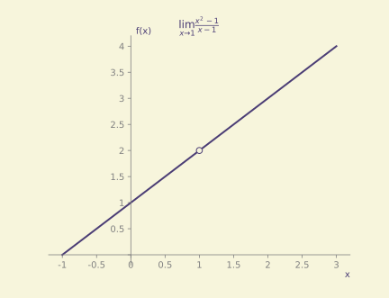
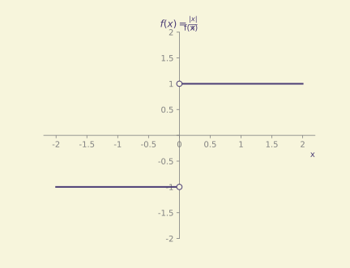
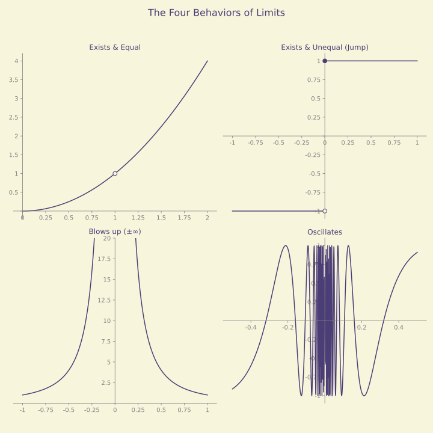
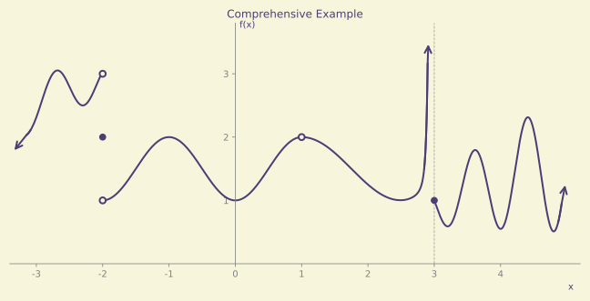
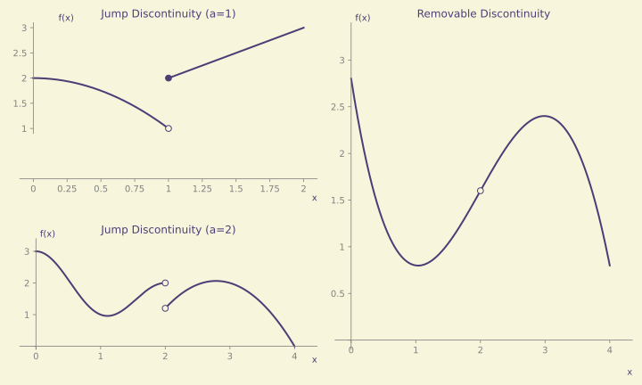

# Limits: A Pedagogical Guide

## The Core Concept: Approaching

When studying limits, the central keyword is ***Approaching*** moving closer and closer to a value without necessarily reaching it.

### Example

Consider the function:
$$f(x) = \frac{x^2 - 1}{x - 1}$$

If we attempt to evaluate this function directly at $x = 1$:
$$f(1) = \frac{1^2 - 1}{1 - 1} = \frac{0}{0}$$
This is an undefined expression (an indeterminate form). However, the *limit* of the function as it approaches $x=1$ is a well-defined value.

### Numerical Analysis

We can observe the behavior of $f(x)$ as $x$ approaches $1$ from both the left ($x \to 1^-$) and the right ($x \to 1^+$).

| Approaching from Left ($x \to 1^-$) | $f(x)$ | Approaching from Right ($x \to 1^+$) | $f(x)$ |
| :--- | :--- | :--- | :--- |
| 0.5 | 1.50000 | 1.5 | 2.50000 |
| 0.9 | 1.90000 | 1.1 | 2.10000 |
| 0.99 | 1.99000 | 1.01 | 2.01000 |
| 0.999 | 1.99900 | 1.001 | 2.00100 |

As $x$ gets arbitrarily close to $1$ from either side, $f(x)$ approaches $2$.

### Graphical Interpretation

The graph visualizes the function. Note the "hole" at $(1, 2)$, indicating that while the function *approaches* $2$, it is undefined *at* $x=1$.

Formally, we examine the one-sided limits:
$$\lim_{x \to 1^-} f(x) = 2 \quad \text{and} \quad \lim_{x \to 1^+} f(x) = 2$$

Since both the left-hand limit and the right-hand limit approach the same value, we conclude:
$$\lim_{x \to 1} \frac{x^2 - 1}{x - 1} = 2$$

## One-Sided Limits

Sometimes, a function behaves differently depending on the direction from which we approach a point.

- **Left-hand limit ($x \to a^-$):** The value $f(x)$ approaches as $x$ gets closer to $a$ from values less than $a$.
- **Right-hand limit ($x \to a^+$):** The value $f(x)$ approaches as $x$ gets closer to $a$ from values greater than $a$.

Consider the function $f(x) = \frac{|x|}{x}$ near $x=0$:
$$\lim_{x \to 0^-} \frac{|x|}{x} = -1 \quad \text{and} \quad \lim_{x \to 0^+} \frac{|x|}{x} = 1$$

Since the left-hand limit (-1) is not equal to the right-hand limit (1), the overall limit $\lim_{x \to 0} \frac{|x|}{x}$ **does not exist (DNE)**.

## Existence and Behavior

A limit at a point $x=a$ exists if and only if both one-sided limits exist and are equal.

### Common Behaviors

An expression's limit may exhibit one of the following behaviors:

| Behavior | One-Sided Limits | Overall Limit |
| :--- | :--- | :--- |
| **Convergent** | Exist & Equal | Exists |
| **Jump/Break** | Exist & Unequal | Does Not Exist (DNE) |
| **Vertical Asymptote** | $\to \pm\infty$ | Does Not Exist (DNE) |
| **Oscillation** | DNE | Does Not Exist (DNE) |

### Comprehensive Example

Consider a piecewise function with a jump at $x=-2$, a hole at $x=1$, and a vertical asymptote at $x=3$.

$$
f(x)=
\begin{cases}
2.8-0.3\cos\!\big(2.5\pi(x+2.3)\big)+0.8(x+2.3)^3, & x<-2\\[4pt]
2, & x=-2\\[4pt]
1.5-0.5\cos(\pi x), & -2<x<1\\[4pt]
1.5+0.5\cos\!\big(\tfrac{\pi}{1.5}(x-1)\big)+\dfrac{0.0002}{(3-x)^4}, & 1<x<3\\[4pt]
1, & x=3\\[4pt]
1+0.3(x-3)+\big(0.4+0.35(x-3)\big)\cos\!\big(2.5\pi(x-3.6)\big), & x>3
\end{cases}
$$

#### Analysis of Points

| Point | $\lim_{x\to a^-}$ | $\lim_{x\to a^+}$ | $\lim_{x\to a}$ | $f(a)$ |
| :--- | :--- | :--- | :--- | :--- |
| **$x=-2$** | 3 | 1 | DNE | 2 |
| **$x=1$** | 2 | 2 | 2 | Undefined |
| **$x=3$** | $\infty$ | 1 | DNE | 1 |

*Note on $x=3$: Since the function increases without bound from the left, the limit is infinite. In many contexts, this is labeled DNE, as it does not approach a finite real number.*

## Limit Laws

Suppose $\lim_{x\to a} f(x) = L$ and $\lim_{x\to a} g(x) = M$.

- **Addition:** $\lim_{x\to a}[f(x) + g(x)] = L + M$
- **Subtraction:** $\lim_{x\to a}[f(x) - g(x)] = L - M$
- **Multiplication:** $\lim_{x\to a}[f(x) \cdot g(x)] = L \cdot M$
- **Division:** If $M \neq 0$, then $\lim_{x\to a} \frac{f(x)}{g(x)} = \frac{L}{M}$

## Continuity

A function $f$ is **continuous at a point** $x=a$ if:
$$\lim_{x\to a} f(x) = f(a)$$

If either $f(a)$ or $\lim_{x\to a} f(x)$ fails to exist, or if they are not equal, then $f$ is **discontinuous** at $a$.

### Classifying Discontinuities

- **"Jump / break" Discontinuity:** $\lim_{x\to a^-} f(x)$ and $\lim_{x\to a^+} f(x)$ both exist but are **not equal**.
- **"Removable / fixable" Discontinuity:** $\lim_{x\to a^-} f(x)$ and $\lim_{x\to a^+} f(x)$ are **equal**, but the value does not match $f(a)$ (or $f(a)$ is undefined).

    Note: The Intermediate Value Theorem (IVT) is a property of continuous functions, which states that a function takes on every value between $f(a)$ and $f(b)$ on an interval $[a, b]$. Continuity is the requirement, not the result of the IVT.

## Intuition

Calculus is not about calculating a static value; it is about analyzing *behavior* and *patterns* as we approach specific points.
