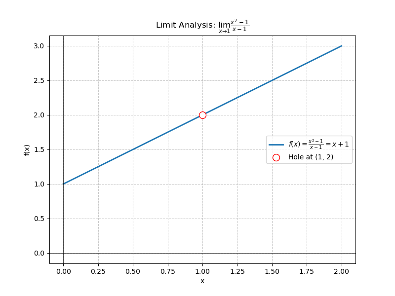

# Limits - Pedagogical Guide

## 1. The Core Concept: Approaching
When studying limits, the keyword to remember is ***Approaching*** (moving closer and closer to a value without necessarily reaching it).

## 2. A Motivating Example
Consider the function:
$$f(x) = \frac{x^2 - 1}{x - 1}$$

If we attempt to evaluate this function directly at $x = 1$:
$$f(1) = \frac{1^2 - 1}{1 - 1} = \frac{0}{0}$$
This is an undefined expression (an indeterminate form). However, the *limit* of the function as it approaches $x=1$ is a well-defined value.

## 3. Numerical Analysis
We can observe the behavior of $f(x)$ as $x$ approaches $1$ from both the left ($x \to 1^-$) and the right ($x \to 1^+$).

| Approaching from Left ($x \to 1^-$) | $f(x)$ | Approaching from Right ($x \to 1^+$) | $f(x)$ |
| :--- | :--- | :--- | :--- |
| 0.5 | 1.50000 | 1.5 | 2.50000 |
| 0.9 | 1.90000 | 1.1 | 2.10000 |
| 0.99 | 1.99000 | 1.01 | 2.01000 |
| 0.999 | 1.99900 | 1.001 | 2.00100 |

As $x$ gets arbitrarily close to $1$ from either side, $f(x)$ approaches $2$.

## 4. Graphical Interpretation
The graph below visualizes the function. Note the "hole" at $(1, 2)$, indicating that while the function *approaches* $2$, it is undefined *at* $x=1$.

Formally, we examine the one-sided limits:
$$\lim_{x \to 1^-} f(x) = 2 \quad \text{and} \quad \lim_{x \to 1^+} f(x) = 2$$

Since both the left-hand limit and the right-hand limit approach the same value, we conclude:
$$\lim_{x \to 1} \frac{x^2 - 1}{x - 1} = 2$$

Remember: The limit $\lim_{x \to 1} f(x) = 2$, even though $f(1)$ is undefined.

## Intuition
Calculus is not about calculating a static value; it is about analyzing *behavior* and *patterns* as we approach specific points.
